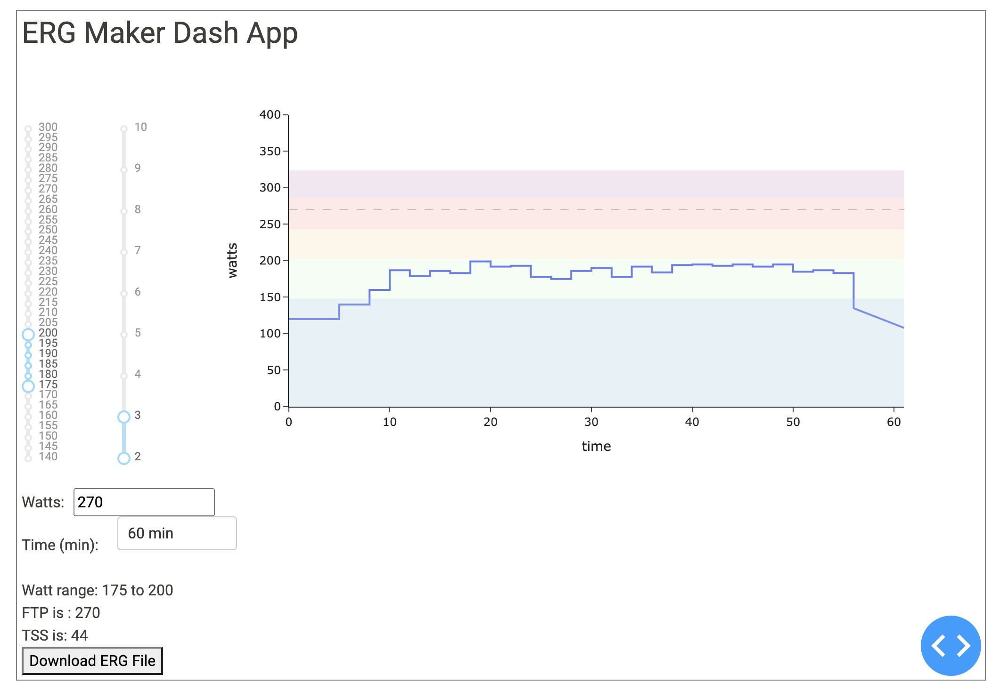

# ergpy
Generates a random indoor trainer workout based on user inputs such as FTP, range in time and intensities

Ergpy is a web-based interface using the Plottly library to change values such as FTP, the ranges in watts and times at each wattage for the session.

You can enter your FTP and select how long you want the work out to be. The graph auto-updates and estimates the TSS for that workout.

Once you are statisified by the the workout, you can download the workout as an erg file and upload it to your trainer software. 
In my case, I use TrainerRoad Workout Creator.

